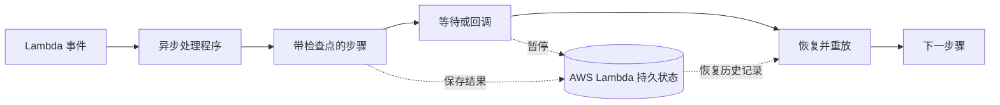

# Python 异步持久执行

[English](README.md) | [繁體中文](README.zh-TW.md)

**使用原生 `async`/`await` 构建长时间运行的 AWS Lambda 工作流程。**
自动为状态创建检查点，无需持续计算即可暂停，并在故障后恢复执行，无需运行工作流程服务器。

[](#deploy-now)
[](#quick-start)
[](https://zhongkechen.github.io/async-durable-execution/)

[](https://github.com/zhongkechen/async-durable-execution/actions/workflows/build.yml)
[](https://zhongkechen.github.io/async-durable-execution/coverage/)
[](https://pypi.org/project/async-durable-execution)
[](https://pypi.org/project/async-durable-execution)
[](https://scorecard.dev/viewer/?uri=github.com/zhongkechen/async-durable-execution)
[](LICENSE)

> 这是采用 Apache-2.0 许可证的
> [AWS Durable Execution Python SDK](https://pypi.org/project/aws-durable-execution-sdk-python/)
> 的社区维护异步分支。

```python
from datetime import timedelta

from async_durable_execution import durable_callable, durable_execution, step, wait


@durable_callable
async def reserve_inventory(order_id: str) -> dict:
    # API 和数据库调用应放在带检查点的步骤中。
    return {"order_id": order_id, "reserved": True}


@durable_execution
async def handler(event: dict) -> dict:
    reservation = await step(
        reserve_inventory(event["order_id"]),
        name="reserve-inventory",
    )
    await wait(timedelta(hours=24), name="payment-window")
    return {"status": "ready-to-ship", "reservation": reservation}
```

已完成步骤的结果会保存为检查点。如果函数在等待期间停止，AWS Lambda 会恢复工作流程并重放已保存的结果，而不会再次预留库存。

## 工作原理



SDK 让应用程序代码保持为熟悉的 Python 协程，同时由 AWS Lambda 存储持久执行历史记录、安排恢复，并在重放期间返回已完成步骤的结果。

<a id="deploy-now"></a>

## 立即部署

使用 [AWS SAM](https://docs.aws.amazon.com/serverless-application-model/latest/developerguide/install-sam-cli.html)
部署随附的 Hello World 工作流程。你需要 AWS 凭证、Python 3.10 或更高版本、Hatch 与 SAM CLI。

```console
git clone https://github.com/zhongkechen/async-durable-execution.git
cd async-durable-execution

hatch run examples:build-layer
hatch run examples:build
hatch run examples:generate-sam-template -- --example-name "Hello World"
sam build --template-file async-durable-execution-examples/template.generated.json

AWS_REGION="${AWS_REGION:-us-east-1}"
sam deploy \
  --template-file .aws-sam/build/template.yaml \
  --stack-name async-durable-hello-world \
  --resolve-s3 \
  --capabilities CAPABILITY_IAM \
  --no-confirm-changeset \
  --region "$AWS_REGION" \
  --parameter-overrides \
    LambdaEndpoint="https://lambda.${AWS_REGION}.amazonaws.com"
```

本仓库是原 Apache-2.0 授权
[AWS Durable Execution Python SDK](https://pypi.org/project/aws-durable-execution-sdk-python/)
的社区维护分支，并在保留上游声明的同时继续以 Apache License 2.0 发布。

创建此分支是因为官方 Python SDK 不支持 `async`/`await`，导致它难以与 `asyncio` 库集成。此 SDK 增加了异步持久可调用对象、后台操作任务、直接的 `asyncio` 任务组合，以及面向现代 Python 应用程序设计的 API。

## ✨ 主要功能

- **异步优先的持久代码** - 与官方 AWS SDK 相比，用户提供的持久事件处理程序、步骤、子上下文、回调提交器、`map()` 项函数、`parallel()` 分支与等待条件检查都使用 `async def` 编写。
- **后台操作任务** - `step(...)`、`wait(...)`、`invoke(...)`、`recurse(...)` 与 `run_in_child_context(...)` 等持久操作会返回 `asyncio.Task` 对象，因此独立操作可以在后台运行，并通过 `asyncio.gather` 一起等待，无需使用 `parallel()` 或 `map()`。
- **简化的持久操作 API** - `v2` API 移除了配置包装对象，改用直接的关键字参数与更清晰的调用位置，包括仅限关键字的操作名称。
- **集成本地与云端运行器** - 运行器功能现在通过 `async_durable_execution` 提供，包含独立的本地与云端运行器工厂，以及带类型的测试结果辅助对象。
- **支持异步 Lambda 客户端** - 安装可选的 `aioboto` extra 即可使用异步 Lambda 客户端；否则 SDK 会通过异步适配器使用内置的同步客户端。
- **通过标准库 logging 提供重放感知日志** - 标准 `logging` logger 会由持久上下文过滤器增强，让工作流程日志在重放时保持安全。
- **Lambda 层打包** - 仓库包含构建与发布 SDK Lambda 层的工具和工作流程，适用于不直接打包依赖项的函数。
- **更完整的验证与文档** - 项目现在包含扩展后的本地/云端运行器覆盖、生成的 API 文档、覆盖率发布，以及针对异步 Lambda 持久性函数更新的示例。

<a id="quick-start"></a>

## 🚀 快速开始

安装 SDK：

```console
pip install async-durable-execution
```

如需异步 Lambda 服务客户端，请安装可选的 `aioboto` extra：

```console
pip install "async-durable-execution[aioboto]"
```

`aioboto` extra 会安装 `aiobotocore`，让 SDK 能为持久检查点与状态 API 创建异步 Lambda 客户端。若未安装，SDK 会通过线程化的异步适配器使用内置的 `botocore` 依赖项。

创建 Lambda 持久性函数的事件处理程序：

```python
import asyncio
import logging
from datetime import timedelta

from async_durable_execution import (
    durable_callable,
    durable_execution,
    step,
    wait,
)

logger = logging.getLogger(__name__)


@durable_callable
async def validate_order(order_id: str) -> dict:
    await asyncio.sleep(0)
    logger.info("Validating order", extra={"order_id": order_id})
    return {"order_id": order_id, "valid": True}


@durable_callable
async def create_receipt(order_id: str) -> dict:
    await asyncio.sleep(0)
    logger.info("Creating receipt", extra={"order_id": order_id})
    return {"receipt_id": f"receipt-{order_id}", "order_id": order_id}


@durable_execution
async def handler(event: dict) -> dict:
    order_id = event["order_id"]
    logger.info("Starting workflow", extra={"order_id": order_id})

    validation = await step(validate_order(order_id), name="validate_order")
    if not validation["valid"]:
        return {"status": "rejected", "order_id": order_id}

    # 模拟审批（实际场景请使用 wait_for_callback）
    await wait(duration=timedelta(seconds=5), name="await_confirmation")

    receipt = await step(create_receipt(order_id), name="create_receipt")

    return {"status": "approved", "order_id": order_id, "receipt": receipt}
```

SDK 接受用户代码的所有位置都必须使用异步可调用对象，包括 `map()` 项函数、绑定的 `parallel()` 分支可调用对象、子上下文、回调提交器与等待条件检查。这些可调用对象可以是函数、实例方法、类方法或静态方法。持久上下文操作是可 await 的，并与事件处理程序运行在同一个 event loop 上。

持久操作会返回 `asyncio.Task` 对象。如果调用操作后没有立即等待它，该操作会被安排在后台运行，之后仍可等待其结果。这让独立操作可以通过常规 `asyncio` 模式并发执行：

```python
pricing_tasks = [
    step(price_line_item(item), name=f"price-{item['sku']}")
    for item in items
]
priced_items = await asyncio.gather(*pricing_tasks)
```

在 Python 3.12 及更高版本中，SDK 使用 `asyncio.eager_task_factory`，使新建的操作任务同步启动并运行到首次挂起。在 Python 3.10 和 3.11 中，`asyncio` 不支持任务立即启动，因此操作任务采用常规的延迟调度；这只会影响执行顺序与性能。

事件处理程序输入会在你的代码运行前，先从持久执行有效载荷反序列化。空白或仅包含空白字符的有效载荷会规范化为 `{}`，格式错误的 JSON 则会在用户代码运行前让调用失败。

### 重放安全的辅助值

当工作流程代码需要常见的非确定性值时，请使用 `random()`、`now()`、`timestamp()` 与 `uuid()`。每个辅助函数都会创建一个具名持久步骤，并在重放期间复用已保存的检查点值。

```python
from async_durable_execution import now, random as durable_random, timestamp, uuid


request_id = await uuid(name="request_id")
created_at = await now(name="created_at")
created_at_seconds = await timestamp(name="created_at_seconds")
sample = await durable_random(name="sample")
```

## 🧪 测试 Lambda 持久性函数

SDK 包含运行器辅助函数，可用于在本地测试 Lambda 持久性函数，或针对已部署的 Lambda 函数进行测试。本地运行器会在进程内运行事件处理程序，使用内存内服务客户端拦截检查点操作，并返回可按操作名称检查的 `DurableFunctionTestResult`。

假设上方快速开始的事件处理程序保存在 `order_workflow.py`，本地测试可以运行同一个 Lambda 持久性函数：

```python
import json

from async_durable_execution import (
    DurableFunctionTestResult,
    InvocationStatus,
    create_local_runner,
)

from order_workflow import handler


async def test_my_durable_function() -> None:
    with create_local_runner(
        handler=handler,
        input={"order_id": "order-123"},
        timeout=10,
    ) as runner:
        result: DurableFunctionTestResult = await runner.run()

    receipt = {"receipt_id": "receipt-order-123", "order_id": "order-123"}

    assert result.status is InvocationStatus.SUCCEEDED
    assert result.result == json.dumps(
        {"status": "approved", "order_id": "order-123", "receipt": receipt}
    )

    validation_result = result.get_step("validate_order")
    assert validation_result.step_details is not None
    assert validation_result.step_details.result == json.dumps(
        {"order_id": "order-123", "valid": True}
    )

    receipt_result = result.get_step("create_receipt")
    assert receipt_result.step_details is not None
    assert receipt_result.step_details.result == json.dumps(receipt)
```

将同一个事件处理程序部署到 Lambda 后，请使用云端运行器测试已部署的 Lambda 持久性函数。函数名称必须以版本或别名限定，例如 `order-workflow:$LATEST` 或 `order-workflow:prod`。

```python
import os

from async_durable_execution import InvocationStatus, create_cloud_runner


async def test_order_workflow_in_cloud() -> None:
    with create_cloud_runner(
        function_name=os.environ["ORDER_WORKFLOW_FUNCTION_NAME"],
        region=os.environ.get("AWS_REGION", "us-east-1"),
        input={"order_id": "order-123"},
        timeout=45,
    ) as runner:
        result = await runner.run()

    receipt = {"receipt_id": "receipt-order-123", "order_id": "order-123"}

    assert result.status is InvocationStatus.SUCCEEDED
    assert result.get_deserialized_result() == {
        "status": "approved",
        "order_id": "order-123",
        "receipt": receipt,
    }
```

## 🧩 示例

Lambda 持久性函数示例位于 `async-durable-execution-examples/src/async_durable_execution_examples/`。可以从 `hello_world.py` 开始，它是最小的完整事件处理程序。

`async-durable-execution-examples/test_examples/` 中的示例测试也很适合作为可执行的模板参考。可按操作或模式浏览：

- `step/`、`wait/`、`wait_for_callback/` 与 `wait_for_condition/` 用于核心持久操作
- `step/steps_with_gather.py` 展示如何启动多个步骤任务，并通过 `asyncio.gather` 一起等待
- `map/`、`parallel/` 与 `run_in_child_context/` 用于组合模式
- `invoke/`（包括 `invoke/recurse.py`）、`with_retry/`、`callback/` 与 `logger_example/` 用于集成与运行行为

如需了解运行或部署示例集成测试的开发者工作流，请参阅[贡献指南](CONTRIBUTING.md#example-integration-tests-and-deployment)。

## 📚 文档

- **[文档网站](https://zhongkechen.github.io/async-durable-execution/)** - 可搜索的指南与从 Python docstring 生成的 API 参考
- **[官方 Python SDK 对比](docs/official-python-sdk-comparison.md)** - 与官方 AWS Durable Execution Python SDK 的并排对比
- **[迁移指南](docs/migrating-from-official-python-sdk.md)** - 从官方同步 Python SDK 迁移到这个异步优先 SDK
- **[使用同步代码](docs/using-synchronous-code.md)** - 安全包装既有同步业务逻辑与阻塞式客户端
- **[高级用法](docs/advanced-usage.md)** - 配置批量完成条件、Lambda 客户端与 Lambda 层
- **[运行器架构](docs/runner-architecture.md)** - 本地与云端运行器的执行流程、组件与图表
- **[贡献指南](CONTRIBUTING.md)** - 开发工作流、Hatch 命令、测试与 pull request 指南

## 参考资料

- **[AWS 耐用执行 SDK 开发人员指南](https://docs.aws.amazon.com/durable-execution/)** - 概念、入门、核心操作、高级主题与 API 参考
- **[Lambda 持久性函数指南](https://docs.aws.amazon.com/zh_cn/lambda/latest/dg/durable-functions.html)** - Lambda 持久性函数的工作方式

## 💬 反馈与支持

- [Bug 报告](https://github.com/zhongkechen/async-durable-execution/issues/new?template=bug_report.yml)
- [功能请求](https://github.com/zhongkechen/async-durable-execution/issues/new?template=feature_request.yml)
- [文档反馈](https://github.com/zhongkechen/async-durable-execution/issues/new?template=documentation.yml)
- [贡献指南](CONTRIBUTING.md)

## 📄 许可证

请参阅 [LICENSE](LICENSE) 文件以了解本项目的许可信息。
