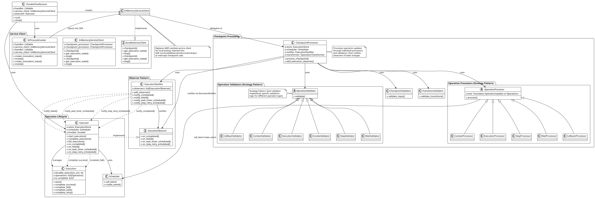
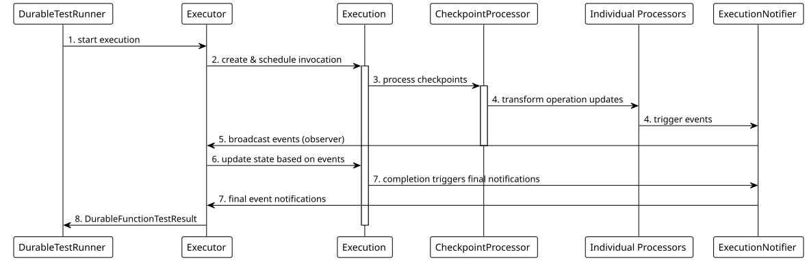

from async_durable_execution.operation import child

# Async Durable Execution Runner for Python

[](https://pypi.org/project/async-durable-execution-runner)
[](https://pypi.org/project/async-durable-execution-runner)


[](https://scorecard.dev/viewer/?uri=github.com/zhongkechen/async-durable-execution)

-----

## Table of Contents

- [Installation](#installation)
- [Quick Start](#quick-start)
- [Architecture](#architecture)
- [Documentation](#documentation)
- [Developer Guide](#developers)
- [License](#license)

## Installation

Requires Python 3.10 or newer.

```console
pip install async-durable-execution-runner
```

## Overview

Use Async Durable Execution Runner for Python to test your durable functions with Python-native local and cloud runners.

This package is distributed from a community-maintained fork of the original Apache-2.0 licensed AWS project and continues under Apache License 2.0 with upstream notices preserved.

The package keeps a local in-process runner for fast testing before deployment, plus a cloud runner for exercising deployed functions.

## Quick Start

### A durable function under test

```python
import asyncio
from datetime import timedelta
from functools import partial
from typing import Any

from async_durable_execution import (
    LambdaContext,
    durable_execution,
    get_current_context,
)


async def one(a: int, b: int) -> str:
    await asyncio.sleep(0)
    return f"{a} {b}"


async def two_1(a: int, b: int) -> str:
    await asyncio.sleep(0)
    return f"{a} {b}"


async def two_2(a: int, b: int) -> str:
    await asyncio.sleep(0)
    return f"{b} {a}"


async def two(a: int, b: int) -> str:
    ctx = get_current_context()
    two_1_result: str = ctx.step(two_1(a, b))
    two_2_result: str = ctx.step(two_2(a, b))
    return f"{two_1_result} {two_2_result}"


async def three(a: int, b: int) -> str:
    await asyncio.sleep(0)
    return f"{a} {b}"


@durable_execution
async def function_under_test(
    event: Any, context: LambdaContext
) -> list[str]:
    context = get_current_context()
    results: list[str] = []

    result_one: str = context.step(one(1, 2))
    results.append(result_one)

    context.wait(duration=timedelta(seconds=1))

    result_two: str = child.run_in_child_context(partial(two, 3, 4), name="two")
    results.append(result_two)

    result_three: str = context.step(three(5, 6))
    results.append(result_three)

    return results
```

### Your test code

```python
import asyncio

from async_durable_execution import InvocationStatus
from async_durable_execution_runner import (
    ContextOperation,
    create_runner,
    DurableFunctionTestResult,
    StepOperation,
)


def test_my_durable_functions():
    with create_runner(
        mode="local",
        handler=function_under_test,
        input="input str",
        timeout=10,
    ) as runner:
        result: DurableFunctionTestResult = asyncio.run(runner.run())

    assert result.status is InvocationStatus.SUCCEEDED
    assert result.result == '["1 2", "3 4 4 3", "5 6"]'

    one_result: StepOperation = result.get_step("one")
    assert one_result.result == '"1 2"'

    two_result: ContextOperation = result.get_context("two")
    assert two_result.result == '"3 4 4 3"'

    three_result: StepOperation = result.get_step("three")
    assert three_result.result == '"5 6"'
```
## Architecture


## Event Flow


1. **DurableTestRunner** starts execution via **Executor**
2. **Executor** creates **Execution** and schedules initial invocation
3. During execution, checkpoints are processed by **CheckpointProcessor**
4. **Individual Processors** transform operation updates and may trigger events
5. **ExecutionNotifier** broadcasts events to **Executor** (observer)
6. **Executor** updates **Execution** state based on events
7. **Execution** completion triggers final event notifications
8. **DurableTestRunner** exposes async runner methods, so `await runner.run()` resolves once the execution completes and returns `DurableFunctionTestResult`.

## Major Components

### Core Execution Flow
- **DurableTestRunner** - Main entry point that orchestrates test execution
- **Executor** - Manages execution lifecycle. Mutates Execution.
- **Execution** - Represents the state and operations of a single durable execution

### Service Client Integration
- **InMemoryServiceClient** - Replaces AWS Lambda service client for local testing. Bound to the durable handler via the `durable_execution(..., service_client=...)` path

### Checkpoint Processing Pipeline
- **CheckpointProcessor** - Orchestrates operation transformations and validation
- **Individual Validators** - Validate operation updates and state transitions
- **Individual Processors** - Transform operation updates into operations (step, wait, callback, context, execution)

### Execution status changes (Observer Pattern)
- **ExecutionNotifier** - Notifies observers of execution events
- **ExecutionObserver** - Interface for receiving execution lifecycle events
- **Executor** implements `ExecutionObserver` to handle completion events

## Component Relationships

### 1. DurableTestRunner → Executor → Execution
- **DurableTestRunner** serves as the main API entry point and sets up all components
- **Executor** manages the execution lifecycle, handling invocations and state transitions
- **Execution** maintains the state of operations and completion status

### 2. Service Client Injection
- **DurableTestRunner** creates **InMemoryServiceClient** with **CheckpointProcessor**
- **InProcessInvoker** rebinds the durable handler with the runner's service client
- When durable functions call checkpoint operations, they're intercepted by **InMemoryServiceClient**
- **InMemoryServiceClient** delegates to **CheckpointProcessor** for local processing

### 3. CheckpointProcessor → Individual Validators → Individual Processors
- **CheckpointProcessor** orchestrates the checkpoint processing pipeline
- **Individual Validators** (CheckpointValidator, TransitionsValidator, and operation-specific validators) ensure operation updates are valid
- **Individual Processors** (StepProcessor, WaitProcessor, etc.) transform `OperationUpdate` into `Operation`

### 4. Observer Pattern Flow
The observer pattern enables loose coupling between checkpoint processing and execution management:

1. **CheckpointProcessor** processes operation updates
2. **Individual Processors** detect state changes (completion, failures, timer scheduling)
3. **ExecutionNotifier** broadcasts events to registered observers
4. **Executor** (as ExecutionObserver) receives notifications and updates **Execution** state
5. **Execution** complete_* methods finalize the execution state


## Developers
Please see [CONTRIBUTING.md](../../CONTRIBUTING.md). It contains the testing guide, sample commands and instructions
for how to contribute to this package.

tldr; use `hatch` and it will manage virtual envs and dependencies for you, so you don't have to do it manually.

## License

This project is licensed under the [Apache-2.0 License](../LICENSE).
