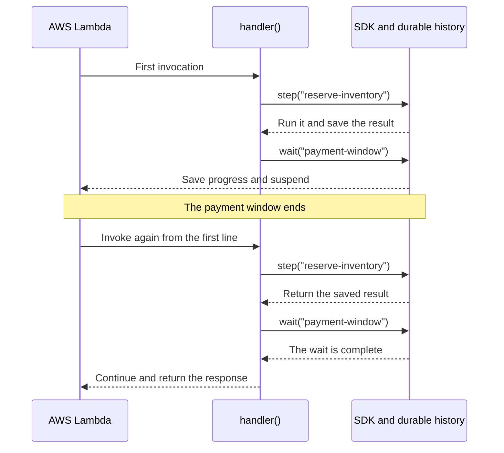

# Async Durable Execution for Python

Build long-running AWS Lambda workflows with native `async`/`await`. The SDK
checkpoints completed work, suspends waits without active compute, and resumes
workflows after interruptions.

[Get started](getting-started.md){ .md-button .md-button--primary }
[Browse the API](async_durable_execution.md){ .md-button }

```console
pip install async-durable-execution
```

```python
from datetime import timedelta

from async_durable_execution import durable_callable, durable_execution, step, wait


@durable_callable
async def reserve_inventory(order_id: str) -> dict:
    return {"order_id": order_id, "reserved": True}


@durable_execution
async def handler(event: dict) -> dict:
    reservation = await step(
        reserve_inventory(event["order_id"]),
        name="reserve-inventory",
    )
    await wait(timedelta(hours=24), name="payment-window")
    return {"status": "ready-to-ship", "reservation": reservation}
```

Completed steps return their checkpointed results during replay instead of
running again.

## Why This SDK

- **Async-first**: handlers, steps, callbacks, child contexts, `flow` nodes, map
  functions, and condition checks use `async def`.
- **Durable primitives**: compose checkpointed steps, waits, callbacks, child
  contexts, invokes, maps, and parallel branches.
- **[Declarative DAG workflows](api/dag.md)**: define validated acyclic graphs
  with typed inputs, conditional dependencies, failure routes, and durable node
  bodies.
- **Normal asyncio composition**: durable operations return `asyncio.Task`
  objects and work with `asyncio.gather()`.
- **Local and cloud testing**: run the same durable handler in memory or against
  a deployed Lambda function.

!!! info "Community maintained"

    This project is a community-maintained async fork of the Apache-2.0 licensed
    [AWS Durable Execution Python SDK](https://pypi.org/project/aws-durable-execution-sdk-python/).
    See the [SDK comparison](official-python-sdk-comparison.md) before choosing
    it for production.

## Execution Model

A durable workflow is **replayed**, not resumed from an in-memory Python stack.
When a wait finishes or an interrupted execution continues, Lambda invokes the
handler again from its first line. The SDK uses the saved execution history to
avoid repeating completed durable operations.



In the example above, `reserve_inventory()` runs only during the first
invocation. On the second invocation, ordinary handler code before the wait
runs again, but `step()` returns the saved reservation instead of calling
`reserve_inventory()` again.

This gives workflow code two different behaviors:

- **Ordinary Python code replays.** For the same event and saved results, it
  must make the same decisions and call durable operations in the same order.
- **Durable operations use history.** Completed steps return saved results, and
  waits or callbacks continue from their recorded state.

Keep API calls, database access, filesystem operations, random values, UUIDs,
clock reads, and other side effects inside checkpointed steps. Standard
`logging` calls are replay-aware and can remain in the handler.

## Next Steps

- Follow the [getting-started guide](getting-started.md).
- Apply common [workflow patterns](workflow-patterns.md).
- [Deploy and invoke](deployment.md) a durable Lambda function.
- Learn the [advanced asyncio patterns](advanced-usage.md).
- Define a [durable DAG workflow](api/dag.md).
- Browse the [durable operations API](api/operations.md).
- Test locally with the [runner API](async_durable_execution/runner.md).
